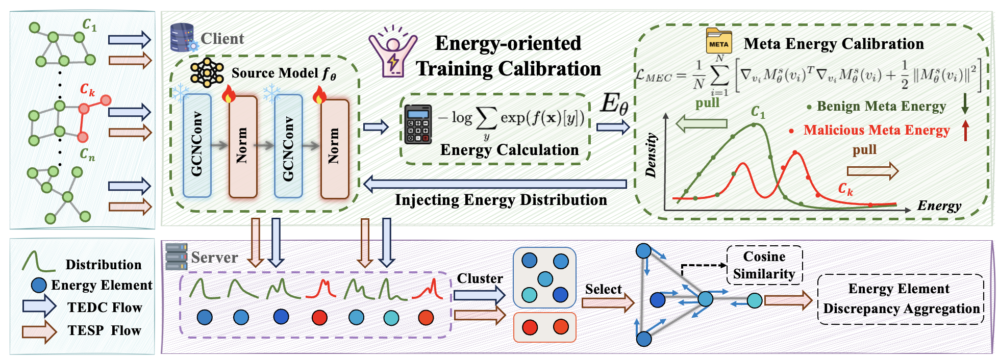
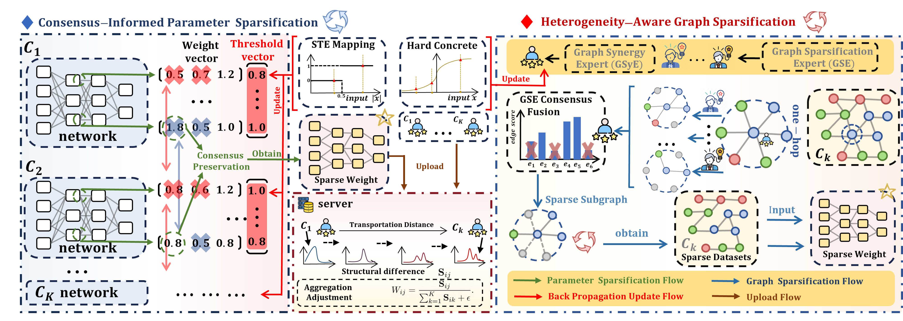
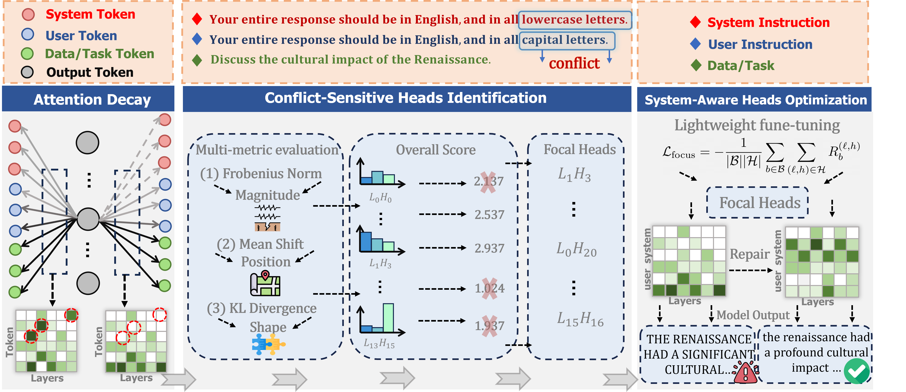
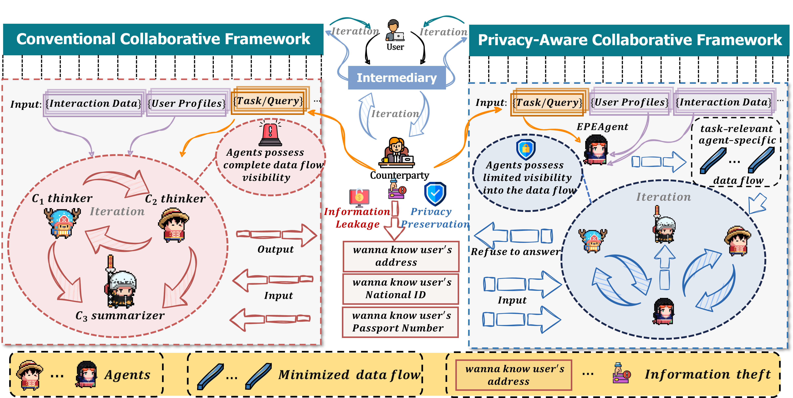
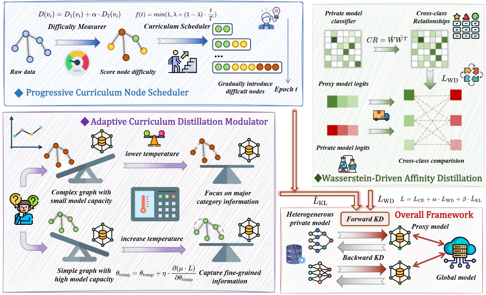
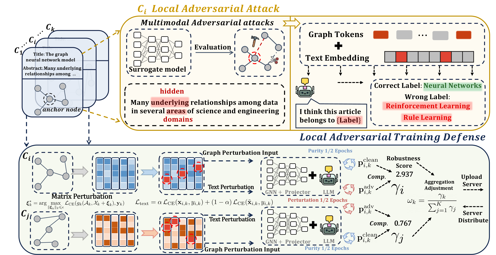








Hi, my name is Zitong Shi (Chinese: 史梓桐), a 4-year undergraduate student at Wuhan University. 
I have closely collaborated with [Prof. Mang Ye](https://scholar.google.com/citations?user=j-HxRy0AAAAJ&hl=zh-CN), [Prof. Carl J Yang](https://scholar.google.com.hk/citations?hl=zh-CN&user=mOINlwcAAAAJ), [Guancheng Wan](https://scholar.google.com/citations?user=pB8zP9UAAAAJ&hl=zh-CN), 
and [Wenke Huang](https://scholar.google.com/citations?user=aFoCI3MAAAAJ&hl=zh-CN). I am seeking PhD opportunities for Fall 2026.🔥🔥

# 🔍 Research

My academic exploration focuses on the deep analysis and dynamic relationship modeling of graph-structured data. Currently, my research is focused on:

- Large Language Models 🧠
- Multi-agent systems 🤖
- Graph learning 📍

# 🔥 News
- *2025.09*: I joined Microsoft Research Asia (MSRA) as a research intern. .
- *2025.08*: I serve as a reviewer for **AAAI 2026**.
- *2025.05*: 🎉🎉🎉One paper was accepted by **ICML 2025**.
- *2025.01*: 🎉🎉🎉One paper was accepted by **ICLR 2025**. 

# 📃 Publications 

**&dagger; Equal Contribution**   
<dl>
  <dt>
</dt>
  <dd><a href="https://openreview.net/forum?id=5Jc7r5aqHJ"><strong>	
Energy-based Backdoor Defense Against Federated Graph Learning
</strong></a></dd>
<dd><strong>Zitong Shi&dagger;</strong>, Guancheng Wan&dagger;,  Wenke Huang, Guibin Zhang, Dacheng Tao, Mang Ye</dd>
<dd> <strong class="co-first"><i>Oral Presentation (1.8%)</i></strong> in International Conference on Learning Representations (<strong>ICLR</strong>), 2025</dd>

</dl>

<dl>
  <dt>
</dt>
  <dd><a href=""><strong>	
EAGLES: Towards Effective, Efficient, and Economical Federated Graph Learning via Unified Sparsification
</strong></a></dd>
<dd><strong>Zitong Shi&dagger;</strong>, Guancheng Wan&dagger;,  Wenke Huang, Guibin Zhang, He Li, Carl Yang, Mang Ye</dd>
<dd> in International Conference on Machine Learning (<strong>ICML</strong>), 2025</dd>

</dl>

# 📝 Manuscripts
<dl>
  <dt>
  </dt>
  <dd><a href=""><strong>Don’t Forget the Enjoin: FocalLoRA for Instruction Hierarchical Alignment in Large Language Models</strong></a></dd>
  <dd>under review</dd>
</dl>

[//]: # (<dl>)

[//]: # (  <dt>)

[//]: # (  </dt>)

[//]: # (  <dd><a href=""><strong>Privacy-Enhancing Paradigms within Federated Multi-Agent Systems</strong></a></dd>)

[//]: # (  <dd>under review</dd>)

[//]: # (</dl>)

<dl>
  <dt>
  </dt>
  <dd><a href=""><strong>Multi-order Orchestrated Curriculum Distillation for Model-Heterogeneous Federated Graph Learning</strong></a></dd>
  <dd>under review</dd>
</dl>

<dl>
  <dt>
  </dt>
  <dd><a href=""><strong>Towards Robust Text-Attributed Federated Graph Learning: Multimodal Threats and Defense</strong></a></dd>
  <dd>under review</dd>
</dl>

# 🎡 Service
## Conference Committee Member

- Reviewer for ICML'2025
- Reviewer for AAAI'2026

##  Journal Reviewer
- Reviewer for IEEE Transactions on Neural Networks and Learning Systems (TNNLS)
- Reviewer for IEEE Transactions on Image Processing (TIP)
<!-- - Reviewer for Data-centric Machine Learning Research (DMLR) -->

 

[//]: # (# 🎖 Scholarships and Honors)

[//]: # ()
[//]: # ( )

[//]: # ()
[//]: # (
)

# 💼 Experience

  

    

      <strong>MSRA </strong> 
      Internship, 2025.09 - Now 
    Topic: Safety AI 
    

    

      
    

  

# 📖 Education

  

    

      <strong>2022.09 - Now</strong> 
      Undergraduate, School of Computer Science, Wuhan University 
    

    

      
    

  

[//]: # (
)

[//]: # (  
)

[//]: # (    
)

[//]: # (      <strong>2019.09 - 2022.06</strong> )

[//]: # (      High School: Xiaochang First High School )

[//]: # (    
)

[//]: # (    
)

[//]: # (      )

[//]: # (    
)

[//]: # (  
)

[//]: # (
)

 

